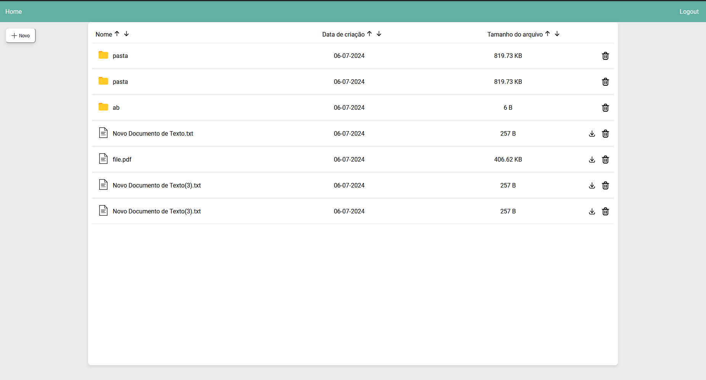

# FileUploadingApp

FileUploadingApp é um aplicativo que permite o upload e 
gerenciamento de arquivos e pastas. Os arquivos são salvos
em um banco de dados PostgreSQL, 
possuí um sistema de autenticação com JWT, 
fazendo com que cada usuário tenha seu conjunto de pastas/arquivos no banco.

## Tecnologias Utilizadas

- Java
- Typescript
- Spring Boot
- Angular
- JWT
- PostgreSQL
- Docker

## Funcionalidades

- **Upload de Arquivos/Pastas:** Cada usuário pode fazer o upload de arquivos e pastas, que são armazenados no banco de dados;
- **Gerenciamento de Arquivos:** É possível baixar, abrir e navegar pelos arquivos que foram armazenados;
- **Filtro de Arquivos/Pastas:** Também é possível fazer o filtro dos arquivos/pastas armazenados por nome, data e tamanho;
- **Autenticação:** Sistema de autenticação com JWT, cada usuário tem acesso só aos seus arquivos e pastas.
## Requisitos

- JDK 17
- Node.js
- Angular
- PostgreSQL
- Docker

## Instalação

1. Clone o repositório:
    ```bash
    https://github.com/Gabriel-sy/FileUploadingApp.gitloadingApp.git
    ```

2. Configure as variáveis de ambiente em `.env`:
    ```properties
    POSTGRES_USER=usuario
    POSTGRES_PASSWORD=senha
    ```

3. Inicie o Spring com docker:
    ```bash
    cd FileUploadingApp
    cd drive-back
    docker-compose up
    ```
4) Instale as dependencias do Angular e inicie o front:
    ```bash
    cd ..
    cd drive-front
    npm install
    npm run start
    ```

## Uso

- Acesse localhost:4200/register, para fazer o registro;
- localhost:4200/login, para fazer o login após o registro;
- localhost:4200/home após fazer o login.


